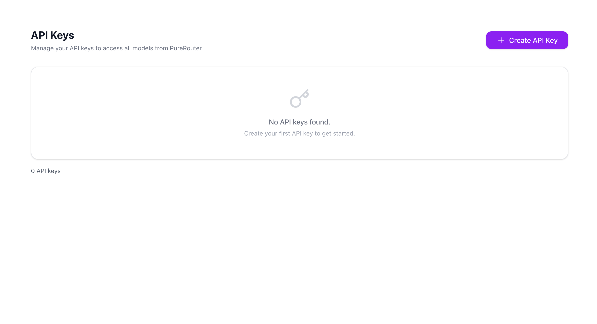
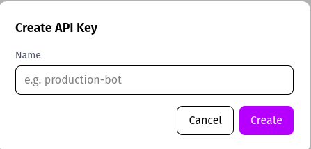
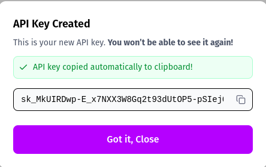
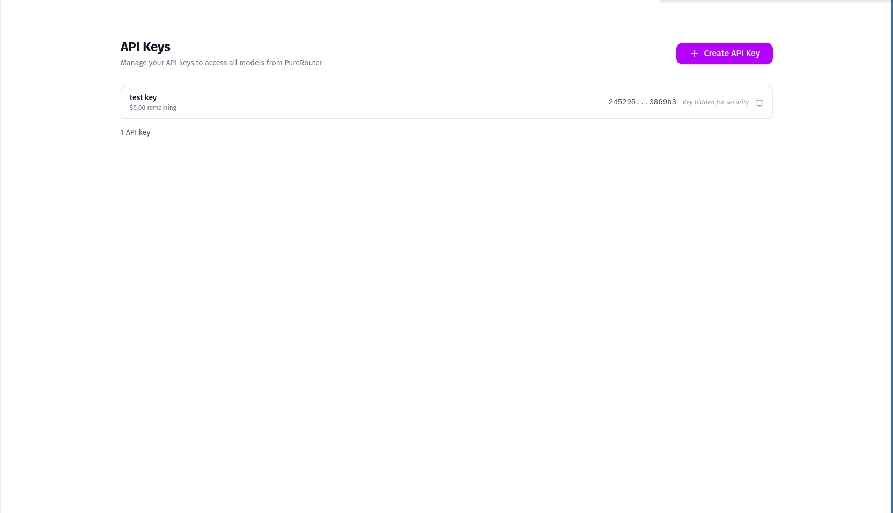

# API Keys

The **API Keys** tab allows you to generate and manage API keys that are required to authenticate with the PureRouter API.

## Creating an API Key

When you first open the **API Keys** tab, you may see that no keys are created yet:

To create your first key:

1. Click **Create API Key**.
2. Enter a descriptive **name** (e.g., `production-bot`, `test-key`).
3. Click **Create**.

## Viewing Your API Key

Once created, a dialog will appear showing your new API key:

<Warning>
  You will only be able to see the key **once**. Make sure to copy and store it
  securely. If you lose it, you’ll need to create a new one.
</Warning>

The key is automatically copied to your clipboard for convenience.

## Managing API Keys

After creation, your API key will appear in the list:

From this view, you can:

- See the **name** of the key
- View partial key details (the full key remains hidden for security)
- Delete the key if it is no longer needed

## Best Practices

<AccordionGroup>
  <Accordion title="Save Keys Securely">
    Store your keys in a secure location, such as a secret manager or environment variable. Never hard-code them in source code.
  </Accordion>

{" "}
<Accordion title="Use Descriptive Names">
  Give each key a clear name (e.g., `staging-service`, `prod-chatbot`) so you
  can easily identify its purpose later.
</Accordion>

  <Accordion title="Rotate Keys Regularly">
    For security reasons, it’s recommended to generate new keys periodically and revoke old ones.
  </Accordion>
</AccordionGroup>

## Next Steps

<CardGroup>
  <Card title="Authentication" icon="lock" href="/purerouter/guides/authentication">
    Learn how to use API keys to authenticate with PureRouter
  </Card>

{" "}
<Card title="Deployments" icon="server" href="/purerouter/guides/deployments">
  Learn how to create and manage model deployments
</Card>

  <Card title="API Reference" icon="code" href="/purerouter/api/reference">
    Check the complete API documentation
  </Card>
</CardGroup>
