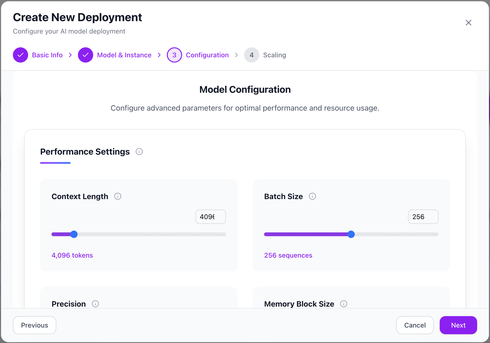

# Deployments

The **Deployments** tab allows you to create and manage AI model deployments inside the router. A deployment provides a private API endpoint where you can serve an open-source or custom model.

---

## Getting Started

When you open the **Deployments** tab, you will see two main sections:

- **Create a new deployment**: Start a wizard to configure and deploy a model.
- **Explore On-Demand Models**: Browse a list of available models that can be deployed with a single click.

---

## Creating a Deployment

Click **Create Deployment** to start the deployment wizard. This process guides you through several steps:

---

### 1. Basic Info

Set a descriptive **endpoint name** for your deployment.
This will help you identify the purpose of the deployment later (e.g., `chatbot-production`, `content-generator`).

---

### 2. Model & Instance

Choose the **model** you want to deploy from the available list. Each model card includes details such as parameter size, optimizations, and typical use cases.

After selecting a model, configure the **instance type**, including GPU and memory settings.

---

### 3. Configuration

Fine-tune your model behavior with the following parameters:

- **Temperature**: Controls randomness of responses. Lower = more deterministic, higher = more creative.
- **Max Tokens**: Maximum length of the model’s output.
- **Top P**: Nucleus sampling threshold.
- **Top K**: Limits the sampling pool to the top K most likely tokens.

---

### 4. Scaling

Set the **maximum number of replicas** your deployment can scale to.
Autoscaling is always enabled, so the router will automatically adjust between 1 and the configured maximum replicas.

You can also add an optional **version comment** to track changes in deployments.

---

## Finalizing the Deployment

Once all steps are complete, click **Create Deployment**.
Your deployment will be provisioned, and you will receive a **Deployment ID**.

This Deployment ID is required to connect to the deployment via the API.

---

## Next Steps

- Use the Deployment ID with the Router API to send requests to your model.
- Manage or delete deployments from this tab when they are no longer needed.

---
