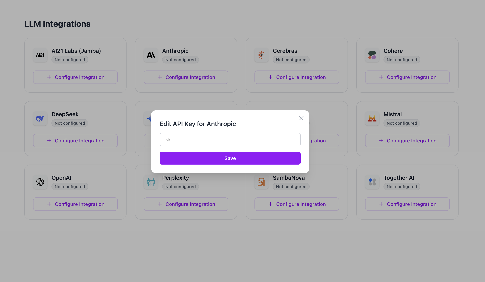
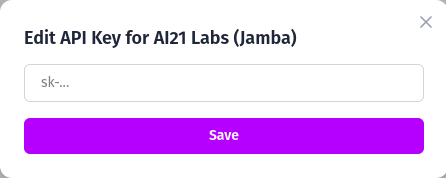
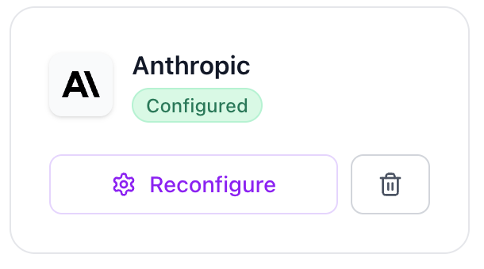

# Integration Keys

The **Integration Keys** tab in the Router Console allows you to manage API keys for different LLM providers that you want to use with PureRouter.

This is the first step in configuring your environment: once the keys are set, you can route requests through the integrated models seamlessly.

## Available LLM Integrations

When you open the **Integration Keys** tab, you will see a grid of supported LLM providers. Each card represents an available provider.

If no API key has been added yet, the card will show the message **"No API Key added yet"** along with a button to add a new integration.

## Adding an API Key

To start using a provider, click on **“+ Add Integration”**.
This will open a modal where you can insert your API key.

Enter your key in the field and click **Save**.
Once saved, the provider card will be updated to show that the API key is configured.

## Managing API Keys

After adding a key, you have two options:

- **Edit**: Update or replace the existing API key.
- **Remove**: Delete the key if you no longer want to use that provider.

This makes it easy to manage your LLM integrations dynamically as your setup evolves.

## Summary

The **Integration Keys** tab provides a centralized place to configure, edit, and remove LLM API keys for PureRouter.
This ensures that you have full control over which providers are active and ready to be used within the router.
