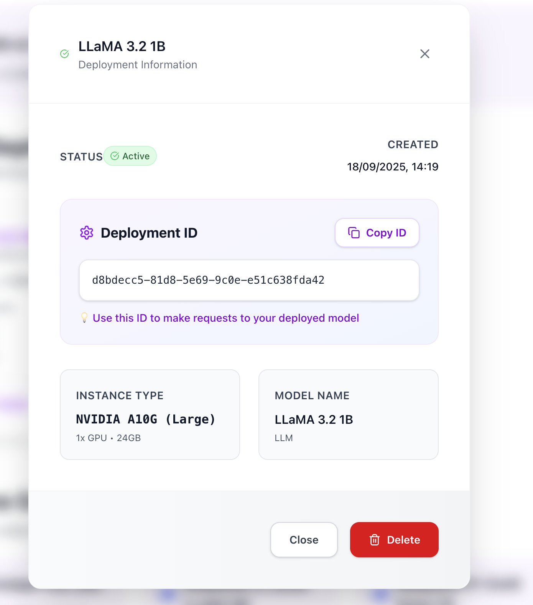

# Deployments

<Note>
  PureRouter is a completely independent product from PureCPP. You can use
  PureRouter without needing PureCPP and vice versa.
</Note>

In addition to automatic routing through profiles, PureRouter allows you to directly access specific models through their deployment IDs. This is useful when you need a particular model for a specific use case.

## Before You Start

To use deployments, you will need:

- An **API Key**, which you can [Generate an API Key](/purerouter/console/api-keys)
- At least one **Deployment**, which you can [create via the Deployments page](/purerouter/console/deployments).

## Accessing Deployments

### Synchronous Deployment Call

To access a specific deployment, you need its unique ID:

```python
from purerouter import PureRouter
from purerouter.types import InvokeRequest

client = PureRouter(
    router_key="sk_...",
    base_url="https://api.purerouter-api.com",
    timeout=300.0
)
deployment_id = "2bd06826-4e42-5105-a270-af36de66daf5"

req = InvokeRequest(
    prompt="Tell a brief story about PureAI.",
    max_tokens=250,
    temperature=0.8
)

result = client.deployments.invoke(deployment_id, req)
text = result["choices"][0]["text"]
print(text)
```

### Asynchronous Deployment Call

For high-performance applications, use async operations:

```python
import asyncio
from purerouter import AsyncPureRouter
from purerouter.types import InvokeRequest

async def main():
    client = AsyncPureRouter(
        router_key="sk_...",
        base_url="https://api.purerouter-api.com",
        timeout=300.0
    )
    deployment_id = "2bd06826-4e42-5105-a270-af36de66daf5"

    req = InvokeRequest(
        prompt="Tell a brief story about PureAI.",
        max_tokens=250,
        temperature=0.8,
        stream=False  # default; may omit
    )

    result = await client.deployments.ainvoke(deployment_id, req)
    text = result["choices"][0]["text"]
    print(text)

asyncio.run(main())
```

## Invocation Parameters

When invoking a specific deployment, you can configure various parameters:

```python
req = InvokeRequest(
    prompt="Explain the concept of machine learning.",
    max_tokens=500,      # Limits response size
    temperature=0.7,     # Controls randomness (0.0 to 1.0)
    top_p=0.95,         # Nucleus sampling
    stream=False        # Set to True for streaming responses
)

response = client.deployments.invoke("deployment-id", req)
text = response["choices"][0]["text"]
print(text)
```

## Response Streaming

To get real-time responses (streaming):

```python
import asyncio
import json
import sys
from purerouter import AsyncPureRouter
from purerouter.types import InvokeRequest

async def main():
    client = AsyncPureRouter(
        router_key="sk_...",
        base_url="https://api.purerouter-api.com",
        timeout=300.0
    )
    deployment_id = "2bd06826-4e42-5105-a270-af36de66daf5"

    req = InvokeRequest(
        prompt="Hi.",
        max_tokens=250,
        temperature=0.8,
        stream=True
    )

    final = []
    async for ev in client.deployments.astream(deployment_id, req):
        line = (ev.data or "").strip()
        if not line or line == "[DONE]":
            continue

        if line.startswith("data:"):
            line = line[len("data:"):].strip()

        try:
            obj = json.loads(line)
        except json.JSONDecodeError:
            sys.stdout.write(line)
            sys.stdout.flush()
            final.append(line)
            continue

        choices = obj.get("choices") or []
        if choices and isinstance(choices[0], dict) and "text" in choices[0]:
            tok = choices[0]["text"] or ""
            sys.stdout.write(tok)
            sys.stdout.flush()
            final.append(tok)

asyncio.run(main())
```

## Use Cases for Direct Deployments

<AccordionGroup>
  <Accordion title="Response Consistency">
    When you need absolute consistency in responses, always using the same model through the deployment ID ensures you'll get predictable results, without variations that can occur with automatic routing.
  </Accordion>

{" "}
<Accordion title="Specialized Models">
  If you've deployed a fine-tuned model for a specific task, you can access it
  directly by ID to leverage its specialized training.
</Accordion>

{" "}
<Accordion title="Comparative Testing">
  To compare the performance of different models on the same task, you can
  invoke each one directly and evaluate the results.
</Accordion>

  <Accordion title="Regulatory Requirements">
    In scenarios where there are specific regulatory requirements about which models can be used, direct access ensures compliance.
  </Accordion>
</AccordionGroup>

## Practical Example: Fallback System

```python
def process_query_with_fallback(query):
    # Try first with the preferred model
    try:
        response = client.deployments.invoke(
            "primary-model-id",
            InvokeRequest(
                prompt=query,
                temperature=0.7
            )
        )
        return response["choices"][0]["text"]
    except Exception as e:
        print(f"Error in primary model: {e}")

        # Fallback to an alternative model
        try:
            response = client.deployments.invoke(
                "fallback-model-id",
                InvokeRequest(
                    prompt=query,
                    temperature=0.7
                )
            )
            return response["choices"][0]["text"]
        except Exception as e:
            print(f"Error in fallback model: {e}")

            # Last resort: use automatic routing
            response = client.router.infer(InferRequest(
                prompt=query,
                profile="balanced"
            ))
            return response.output_text
```

## Deployment ID

Após criar um deployment, você receberá um ID único que identifica seu modelo específico. É com esse ID que você vai se comunicar diretamente com o deployment através da API.



O Deployment ID é essencial para:
- Fazer chamadas diretas para o modelo específico
- Garantir consistência nas respostas
- Acessar modelos especializados ou fine-tuned
- Implementar sistemas de fallback

## Next Steps

<CardGroup>
  <Card title="Python SDK" icon="python" href="/purerouter/guides/sdk-python">
    Learn to use the PureRouter Python SDK
  </Card>

{" "}
<Card
  title="Routing Profiles"
  icon="route"
  href="/purerouter/guides/routing-profiles"
>
  Learn more about economy, balanced, and quality profiles
</Card>

  <Card title="API Reference" icon="code" href="/purerouter/api/reference">
    Check the complete API documentation
  </Card>
</CardGroup>
